## In-Depth Anyalysis of the Threat of Moderated Combatants and Injury Deterrence in the Modern NHL

### Background and Role of Fighting in the NHL

Five years into the National Hockey League, in 1922 Rule 56 was officially instituted in the NHL rulebook. Fisticuffs, condones the act of fighting between two individuals stating that the two players will be assessed a five minute major penalty, along with some other language about instigation which has since largely been abandonded. By modern definition, a fight is defined as when at least one player punches or attempts to punch an opponent repeatedly or two players wrestle in such a manner that make it difficult for officials to intervene. Since its inception, the the presence of fighting has been grounded in its ability to deter violent, injury-prone behavior throughout gameplay, with the notion that self-regulation and threat of having to respond to an altercation will detract players from engaging in dangerous play. 

Annectodally, over the past decade, the appearance of altercations in relation to play related to intent to injure behavior or illegal collisions has been seemingly dwarfed by those altercations ignited by violent legal collisions, emotional factors such as game outcome, or simply premeditated bouts. The latter of which directly contradict the NHL's original purpose of the activity, and has been a subject of fan's sore attitude for years. 

Importantly, the NHL's policies effect individuals beyond the scope of the league, as many North American travel and junior models emulate the rule structure dictated by the NHL, and hence condone fighting. In 2024 Boston University concluded a study linking over half of 77 deceased male hockey players to having CTE, and found that with each additional year of playing the sport, the risk of developing CTE increased by 34%. In an attempt to further understand the role, importance, and necessity of fighting in the NHL, and its impact on the lives of players, this research aims to analyze the networks effects of players engaged in bouts of belligerence and predict the sucess of NHL teams and franchises based on engagement in the activity.

### Initial Network Analysis and Findings
To begin the investigation, top-level descriptive network analysis was conducted. First, fighting prevalence by count of altercations per season was plotted as shown below. Annual altercations since the 2000 season certainly have been on the decline up until modern day, which is consistent with the theory that the threat of fighting is effective in thwarting injure-prone behavior. However, alternative reasonings could be suggested as the core cause of the decline, such as skill-gap closure, demographic shifts, or cultural shifts within the league and the decline alone is not conclusive evidence of deterrence. 

#### Figure 1: Annual Count of NHL Fights from 2000-2026 Seasons
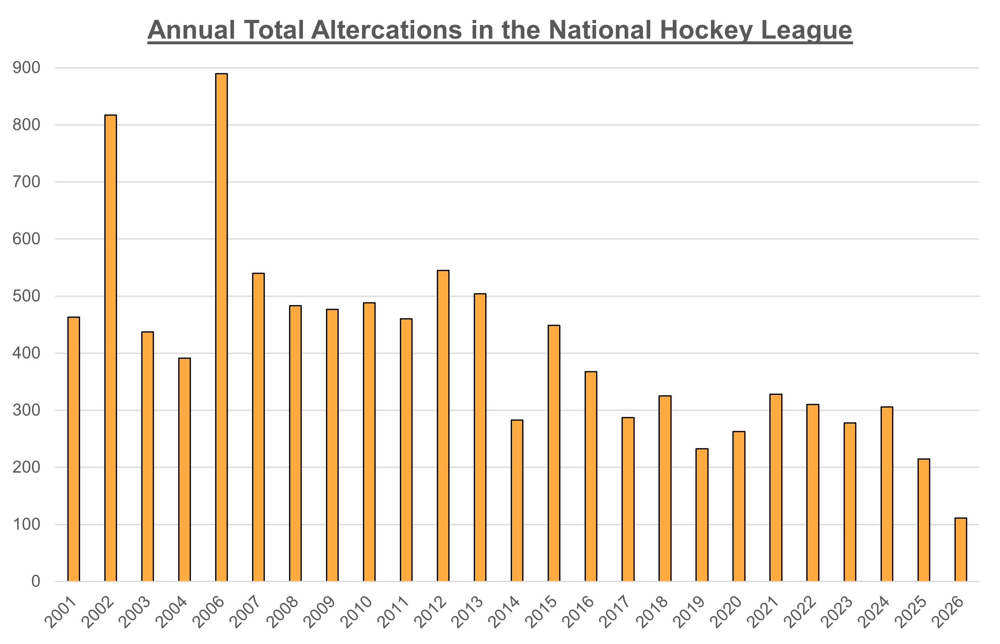

To begin understanding the network of fighters, it was broken out into three separate sub-networks: The Entire NHL, No Isolates (removal of non-fighters), and Experienced Fighters (those with more than 10 Fights). The team thought value could be derived through analyzing the seperate sub-components of the league to develop further insights into the role of fighting in the NHL. The first metrics of note were the degree centralization, betwenees, and eigvenvector centralizations of the three-subnetworks. Degree centralization remained low across all three networks, and naturally rose with the removal of isolates. Within these two networks, the amount of players with either 0 or 1 altercation is so numerous that degree can appear to be evenly distributed across the entire network. Interestly, when filtered for Experienced Fighters, degree centralizations continues to rise to 0.13, indicating that within that subnetwork there is a number of individual fighters carrying a higher total number of altercations than the rest of the network. This is the first piece of evidence pointing toward the presence of non-random and unequal distribution of fighting responsibilities in the league. 

Subsequently, betweenness centralization also continues to rise as the network is constrained for Experienced Fighters, which is indicative that there are a small number of individual players that hold the shortest geodesic path between any other player within the Experienced Fighter network. This is significant because it suggests that a small number of players broker fighting culture, bridging gaps between otherwise non-deeply connected fighters across the league. Most significantly, eigenvector centralization is extremely high for all three networks, and unsurprisingly drops as the number of players in each subnetwork is reduced. The strikingly high eigenvector centralization showcases that a few players are highly influential in the network, measured not just by the number of connections they have, but also factoring in the influence and importance of those connections. In other words, there is a strong backbone of core fighters in the league that are not only highly active altercations, but specifically are also highly connected to one another, further reinforcing the notion of non-random patterns of fighting contraditctory of  that would be expcted per the injury-deterrence theory. 

#### Table 1: Centralization Metrics of the Three Sub-Networks
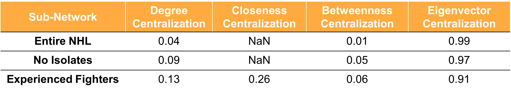

Upon establishing the presence of a core of fighters in the league through centralization analysis, the next step was to understand K-Core Groups to find the distribution of eigenvector centrality in the Experienced Fighter sub-network. Within Experienced Fighters, a non-normal distirubtion was discovered with irregularities in the right-tail, as shown in Figure 2. The unequal distribution of players in highest K-Core groups of Experienced Fighters further illustrates the non-random share of fighting responsibilities allocated within game play. It is a supplemental signal for the presence of a dense backbone of individuals that are holding a significant portion of fighting burden, specifically with one another.

#### Figure 2: Distribution of Experienced Fighters Across K-Core Groups
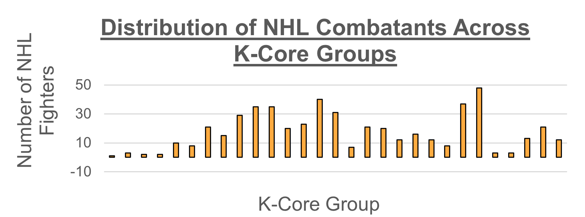

### Clustering Patterns and Community Detection in the Modern NHL Fighter Network

Initial tests of density and transitivity showcased interesting results displayed in Table 2. Naturally, the density of the entire NHL Network is sparse, demonstrating that is is rare for any two players in the league to engage in an altercation. However, when focusing on the Experienced Fighter sub-network, the density dramaticalyl increases to 6.06%, a significant increase in the likelihood of any two players participating in a fight with one another. Furthermore, the transitivity amongst all three sub-networks is dramatically higher than what would be expected by chance. Transitivity showcases the likelihood that players B and C engage in an altercation given that players A and B, and A and C already have engaged. This figure strikes as alarmingly high, as it demonstrates the behavior of fighters to naturally form triads which is a strong signal of clustering. Triad formation and clustering is the antithesis of the injury-deterrence theory, which should be governed by random bouts of unruly behavior that needs to be settled. The results are proven to be significantly greater than would be expected by chance through Conditional Uniform Graph (CUG) tests, which test for transitivity amongst simulated networks of the same size and density. Figure 3 shows that all three of the analyzed sub-networks have a transitivity much higher that the simulated networks would have predicted. As stated, the presence of triad formation is a key piece of evidence in the lack of randomness within the fighter network. 

#### Table 2: Efficiency, Density and Transitivity of the Three Sub-Networks
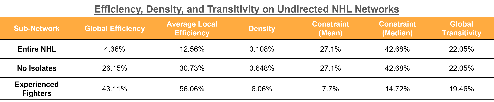

#### Figure 3: Conditional Uniform Graph Tests of Transitivity
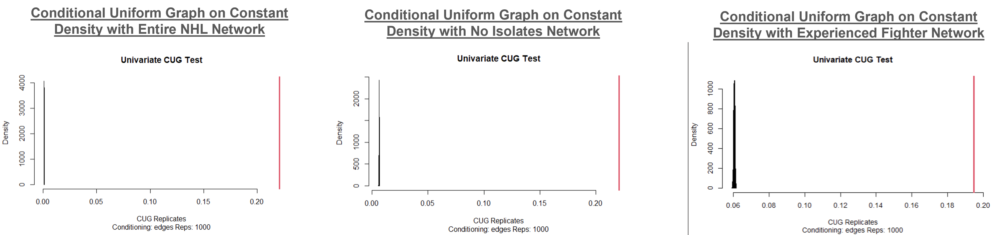

The next step was to conduct further research into clustering patterns and community detection amongst NHL combatants. To perform community detection, SpinGlass and Leading Eigenvector algorithms were employed to search for stucture within the network of Experienced NHL Fighters. Both alorgithms detected moderate structure as displayed by the modularity scores in Figures 4 and 5. Notably, neither algorithm detects community structure that is consistent with NHL league structure, which would expect to see communities form similarly to conference and/or division alignment. While the SpinGlass algorithm detects 6 communities, similar to NHL divisional structure, the community sizes of are wide variance which is inconsistent with what is known about division sizes. The Leading Eigenvector alorigthm detects 9 communities of wide ranging sizes, indicating while structure is found with the sub-network of Experienced Fighters, it is not displaying patterns aligns with NHL structure that should accompany the injury-deterrence theory. 

#### Figure 4: Community Detection Using SpinGlass
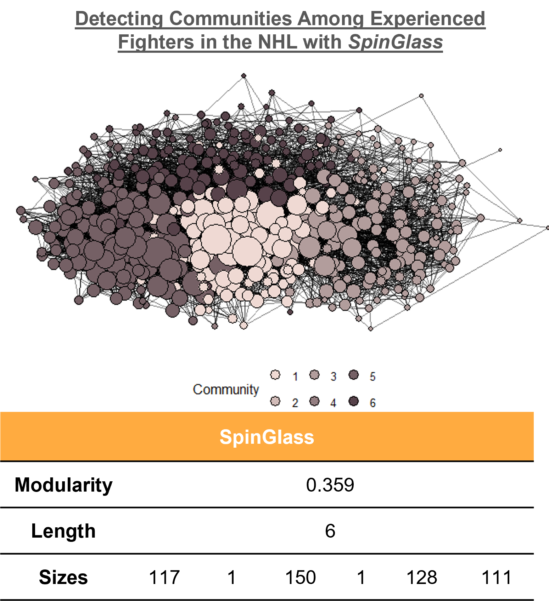

#### Figure 5: Community Detection Using Leading Eigenvector
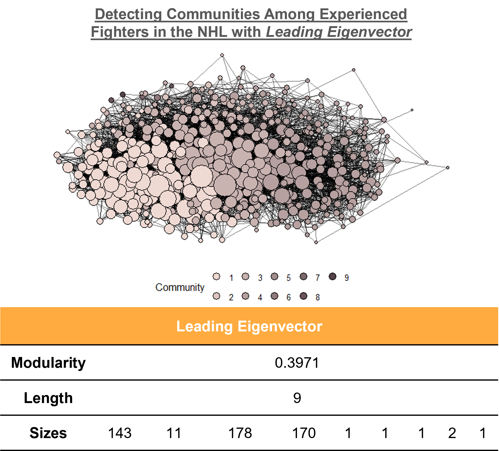

### Expontential Random Graph Modeling of NHL Fighter Network

To continue to demonstrate the non-randomness of the NHL Fighter Network, an Exponential Random Graph Model (ERGM) was employed to analyze the factors that may lead to two individuals engaging in an altercations, predicitve factors in deciding a fight winner, and the Goodness-of-Fit of the model. It is important to note that the ERGM model does not accept duplicat edges, so final numbers may deviate from above. Findings shown in Table 3 demonstrate that Model 1 shows there is a 0.52% chance of any two players engaging in an altercation at random, while Model 4 demonstrates that for each each of height between the two combined NHL Players there is a ~1.5% higher chance of the two engaging in a fight and for each additional pound of weight in the player combination the chance of an altercation decreases by ~0.2%. Showcasing that lean, tall individuals are more likely to engage which is consistnet with conventional fight wisdom on reach. 

Critically, Model 5 utilizes fan-vote metrics from hockeyfight.com to determine each altercation winner, and finds that for each additional inch of height a participating player stands, the probability of losing an altercation increases by 1.9%, similarly with each additional pound a participating player weighs, the probability of losing an altercation increases by 0.3%. This strikes as alarming as physicaly traits that increase the likelihood of fighting, decrease the likelihood of winning, which is counterintuitive to fighting culture and wisdom and brings into question the safety of the individuals encouraged to engage in altercations. 

Lastly, the ERGM model was used to showcase the Goodness-of-Fit of the model, and once again demosntrated that the network of NHL fighters is more likely to form clusters than by random chance, further damaging the injury-detterence theory. Figure 7 demonstrates that the poor fit of edge-wise shared parameters is evident of the network's proclivity to form triads, and the modularity of the true network far exceeds the modularity prediced by simulation.

#### Table 3: ERGM Model Outputs of the Entire NHL Network
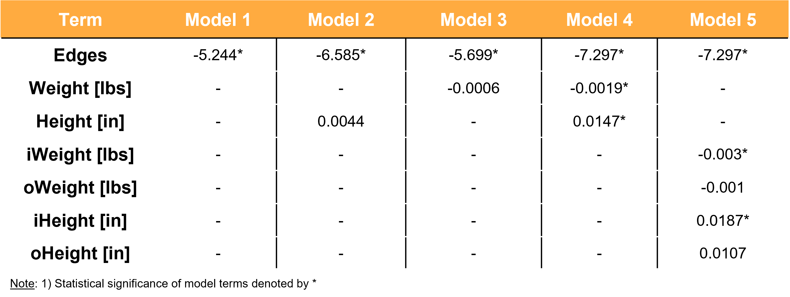


#### Figure 7: ERGM Goodness-of-Fit Tests
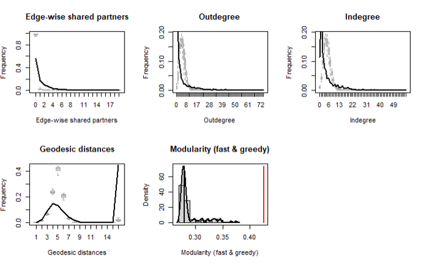

### Game Analysis of Fighting and its Correlations with Physicality and Regular Season Wins

Figure 8 shows us that overall we find that more hits are associated with more fights and its is statistically significant. The relationship does not determine causation, however. Still the math shows that within a season, each fight is associated with approximately 12 more hits. Model 3 does showcase that fights from last season are associated with more fights for this season, which should be in question if the injury-detterence theory is to hold. Importantly, from this data there is no evidence that prior season fighting reduces subsequent physicality.

#### Figure 8: Relationship Between Total Hits and Fights Per Season
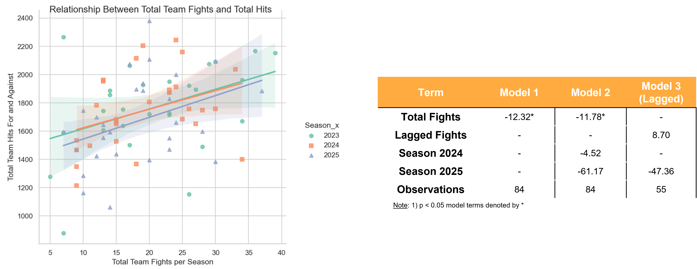

From Figure 9, we can initially see that there is no true correlation between teams with high fight totals and their regular season win totals. In the 2025 season, there is a large cluster of non-playoff contending teams with a high fight total which is of note. We further examed this through regression as shown in Figure 10. In this regression, we find that season success is loosely correlated with the number of fights. Roughly for every 10 fights a team engages in, the amount of regular season wins decreases by about 2. It should be noted that the significance of this only under 0.10. With that said, it can strongly be claimed that there is no evidence that fighting improves regular season win total.

#### Figure 9: Most Prolific Fighting Teams by Season
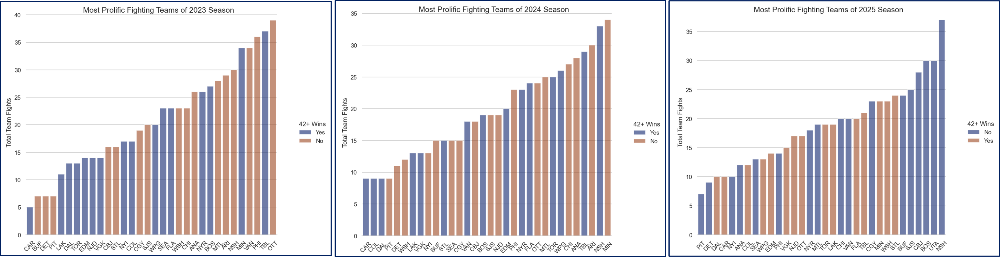

#### Figure 10: Relationship Between Total Team Fights & Regular Season Wins


### Conclusion and Future Research

Results consitently demonstrate that the network of NHL Fighters does not fit random patterns of altercations that would expect to be generated under the injury-deterrence theory. Instead, there is a strong presence of a dense, interconnected core group of fighters that broker fighting culture across divisions, conferences, and seasons. This has been demonstrated through the evidence of triad, clustering, and community formation being significantly higher than expected by random chance. This suggests that self-policing within the NHL is centered around repeat actors rather than isolated acts of deterrence, and ERGM models indicate conventional fighting culture and wisdom are potentially putting players of specific physical attributes at risk. 

Furthermore, evaluating the relationship between fighting and physicality, there is no evidence to suggest that fighting reduces subsequent season physicality. Additionally, there is no data to suggest that more team fights is helpful to regular season success.

Given the established links between CTE and ice hockey, and its limited demonstration on season impact, changes to tolerated fighting in the NHL can improve health outcomes for young athletes across the globe.

To continue the research, the team will look to restructure data to begin classifying division/conference alignment as a node attribute rather than an edge attribute. Second, the team would like to integrate time-driven gameplay analytics before and after altercations to understand the root cause of instigation and dynamics imposed on an individual game. Finally, the team will look to integrate season and franchise level success metrics to gather inteligence on the impact of fighting on team success and roster management. 

## Features

The NHL Fighter Analysis program is designed as a free tool for NHL organizations, analysts, and fans to track and analyze player altercations in the National Hockey League. This application extracts all NHL roster information from hockey-reference.com , all recorded Fighting Majors from hockeyfights.com for seasons of interest (set to 2000-2026 seasons), and all recorded games from 2023-2025 seasons,  and utilizes Python and R packages to demonstrate network effect and predictive modeling of player altercations to aid in league decision making.

## Tech Stack

### Data Collection and Cleaning:

- Python, Pandas, Regex, Playwright, BeautifulSoup4, Requests

### Data Analsysis:

- Network Analysis: R (btergm)

## Data Collection, Cleaning, and Assumptions

### 1) 2000-2026 NHL Rosters Scraped from hockey-reference.com

#### 1a.) Unique Player Indentification
Node List:

For establishment of a complete node list, each player is uniquely identified by string concatenation under the assumption that no plyer simultaneously shares the same Full Name, Birthdate, and Birthplace between Seasons 2000-2026. Duplicate players were removed, and remaining unique individuals were assigned a numerical ego_id for network analysis and identficiation purposes. From hockey-reference.com, applicable extracted node attributes consisted of ego_id, season, team, birthplace, birthdate, position, handedness, height, and weight.

Edge List:
To link ego_id to the fight list (edge list), a second string concatention ID was created for each player under the assumption that no team has multiple players with the same FirstInitial.LastName in a single season and was created from FirstInitial.LastName|Team|Season. The second ID was needed to merge ego_id with string concatenated ID's generated from hockeyfights.com (described below) to create the final edge list for network analysis. 

### 2) 2000-2026 NHL Fighting Majors Scraped from hockeyfights.com

Information gathered from hockeyfights.com consisted of abbreviated player names engaged in an altercation, altercation date, altercation winnter, fan-voting percentage, number of votes, and the season of the altercation. Gathered data first needed to be stripped and cleaned of extraneous characters and paranthetical information using Regex. Subsequently, for establishment and merging of the complete edge list, each player in an altercation was given a string concatentation ID by FirstIntial.LastName|Team|Season under the same assumptions as the roster data.

The edge list was then finalized by merging egos (as fight winners) and alters (as fight losers) from the unique ego_id's generated from the roster data and matching FirstInitial.LastName|Team|Season IDs. 

### 3) 2023-2025 NHL Regular Season Game Data from espn.com

Information gathered from espn.com consisted of team status such as box score, hits, faceoff percentage, shots on goal, and a period by period penalty and scorying summary. Gathered data first needed to be stripped and cleaned of extraneous characters and paranthetical information using Regex. Subsequently, data was grouped for game winners and total hits to find each franchise's totals by season and combined with the fights information from our edge list. This informationw as used to generate correlations of fighting and game outcomes, as well as fighting and physicality.

## Getting Started (Run Locally)

### 1) Clone the Repository

```bash

git clone https://github.com/chrisrovero2344/NHLFighterAnalysis

cd ~/NHLFighterAnalysis
```

### 2) Create and Activate a Virtual Environment in the Repository (Windows PowerShell)

```powershell

py -m venv venv

Set-ExecutionPolicy -Scope Process -ExecutionPolicy Bypass

.\\venv\\Scripts\\Activate.ps1

```

You should see `(venv)` in your terminal prompt.

### 3) Install Dependencies

```powershell

pip install --upgrade pip

pip install pandas, bs4, requests, playwright

```

### 4) Run the Roster Scraping Script

```powershell

python roster_scrape.py

```

### 5) Run the Fight Scraping Script

```powershell

python fight_scrape.py

```

### 6) Run the Edge List Creation Script

```powershell

python edge_list_creation.py

```

## Inspiration

As a former player at the travel and junior levels, and lifelong fan of the sport (LGR), I have consistently been faciscinated with the implications of fighting on the outcome of games and player's lives. This project was a combination of my passion for the game and putting new skills to work. 